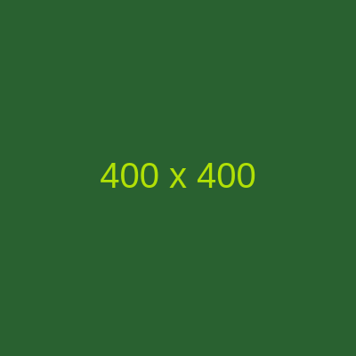

<!doctype html>
<html lang="en">
  <head>
    <!-- Required meta tags -->
    <meta charset="utf-8">
    <meta name="viewport" content="width=device-width, initial-scale=1, shrink-to-fit=no">

    <!-- Brand CSS-->
    <link rel="stylesheet" href="css/styles.css">

    <!-- Bootstrap CSS -->
    <link rel="stylesheet" href="https://stackpath.bootstrapcdn.com/bootstrap/4.5.0/css/bootstrap.min.css" integrity="sha384-9aIt2nRpC12Uk9gS9baDl411NQApFmC26EwAOH8WgZl5MYYxFfc+NcPb1dKGj7Sk" crossorigin="anonymous">

    <!-- Mapbox -->
    
    <link href='https://api.mapbox.com/mapbox-gl-js/v1.11.0/mapbox-gl.css' rel='stylesheet' />

    <title>Nitro Blend</title>
  </head>
  <body>
    

        <header>
            <nav class="navbar navbar-light" style="background-color: #ffffff;">
                <a class="navbar-brand" href="#">
                    
                    Nitro Blend Limited
                </a>
                
                <ul class="nav justify-content-end" id="dp">
                    <li class="nav-item">
                        <a href="#about" class="nav-link">About</a>
                    </li>
                    <li class="nav-item">
                        <a href="#products" class="nav-link">Products</a>
                    </li>
                    <li class="nav-item">
                        <a href="#team" class="nav-link">Team</a>
                    </li>
                    <li class="nav-item">
                        <a href="#contact" class="nav-link">Contact</a>
                    </li>
                </ul>
                
            </nav>
        </header>
    
        <section id="about">
    
        </section>
    
        <section id="products">
            

                <h3>Our Products</h3>    
            

            

                

                  
                  

                    <h5 class="card-title">Product Name</h5>
                    
Lorem ipsum dolor sit amet, consectetur adipiscing elit. Phasellus id lacus bibendum, semper lectus bibendum, rhoncus tortor. Vestibulum nec enim in ipsum sagittis dapibus non ut ligula.

                  

                

                

                  
                  

                    <h5 class="card-title">Product Name</h5>
                    
Lorem ipsum dolor sit amet, consectetur adipiscing elit. Phasellus id lacus bibendum, semper lectus bibendum, rhoncus tortor. Vestibulum nec enim in ipsum sagittis dapibus non ut ligula.

                  

                

                

                  
                  

                    <h5 class="card-title">Product Name</h5>
                    
Lorem ipsum dolor sit amet, consectetur adipiscing elit. Phasellus id lacus bibendum, semper lectus bibendum, rhoncus tortor. Vestibulum nec enim in ipsum sagittis dapibus non ut ligula.

                  

                

            

        </section>
        
        <section id="contact">
            

                <h3>Contact us</h3>    
            

            

                

                    
                    

                        
+254 7XX XXXXXX

                        
info@nitroblends.com

                        
Big Building, Road St.

                        
Nairobi, Kenya

                    

                

                

            

        </section>
    
        <footer>
            
Nitro Blend Limited &copy; 2020

        </footer>
    

    <!-- Mapbox -->
    

    <!-- Optional JavaScript -->
    <!-- jQuery first, then Popper.js, then Bootstrap JS -->
    
    
    
  </body>
</html>